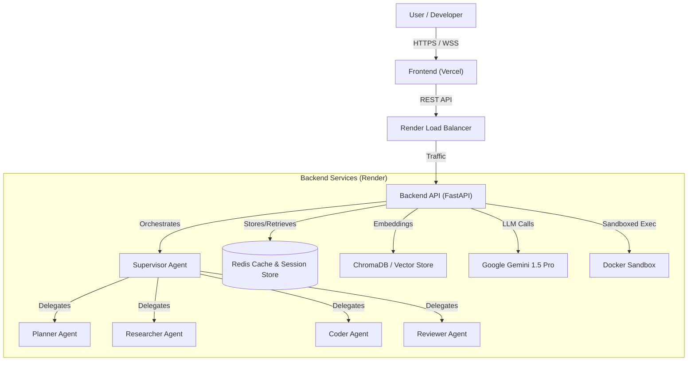
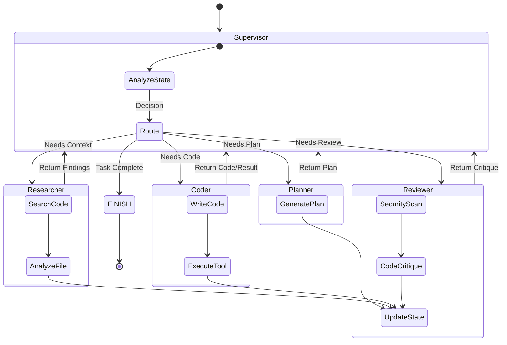
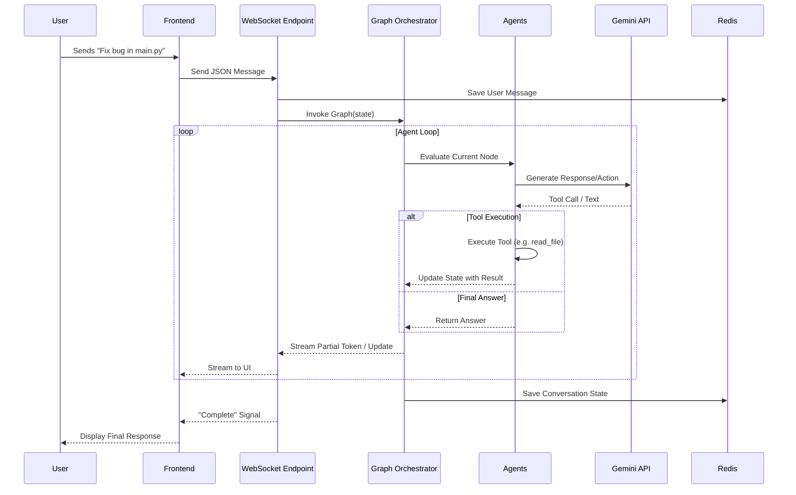
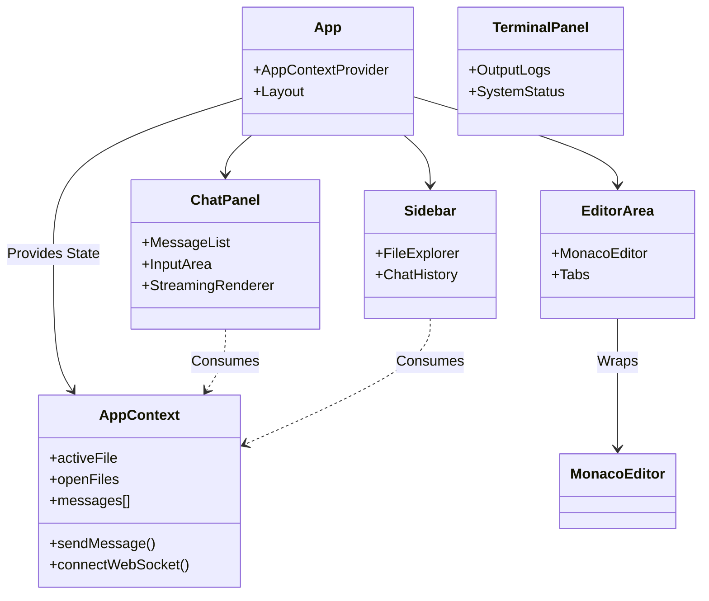
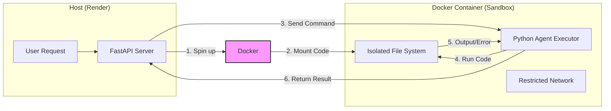

# Construct AI Code Reviewer - System Architecture

This document provides a comprehensive visual overview of the Construct AI Code Reviewer system architecture, including high-level component interaction, multi-agent workflows, data flow, and deployment structure.

## 1. High-Level Architecture Overview

This diagram shows how the User interacts with the Frontend (deployed on Vercel) and how requests flow to the Backend (deployed on Render), which orchestrates the AI Agents and services.

## 2. Multi-Agent Workflow (LangGraph)

The core intelligent engine of Construct is built on **LangGraph**. A **Supervisor Node** acts as the router, deciding which specialist agent should handle the next step based on the conversation state.

## 3. Request Processing Flow (WebSocket)

This sequence diagram illustrates the real-time communication flow when a user sends a message (e.g., "Fix this bug") via the WebSocket connection.

## 4. Frontend Component Structure

The React frontend handles the IDE-like interface, managing editor state, file trees, and the chat terminal.

## 5. Security & Sandbox Architecture

Code execution is isolated to prevent malicious or accidental damage to the backend server.

