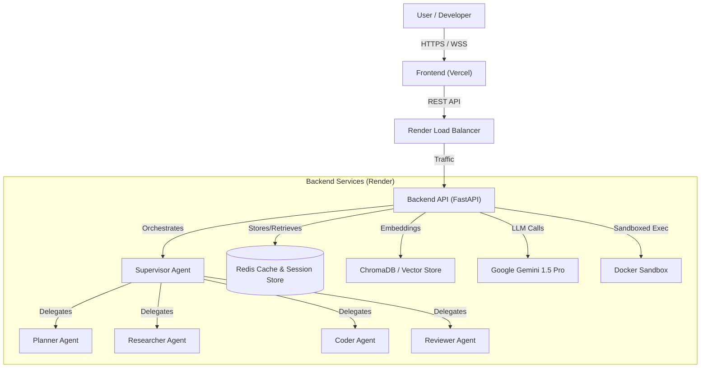

# AI Code Reviewer Backend

Production-ready backend for an AI code review system using LangGraph, Tree-Sitter, Docker sandbox, and Redis.

## Features

- **🤖 LangGraph Agent System**: Supervisor pattern with specialized worker nodes
- **🔍 Code Indexing**: Tree-Sitter based Python code parsing and analysis
- **🐳 Docker Sandbox**: Safe, isolated code execution with resource limits
- **💾 Redis State Management**: Persistent state storage with connection pooling
- **🔒 Security**: Path validation, file size limits, command timeouts
- **📊 Logging**: Structured JSON logging with multiple log levels
- **⚙️ Configuration**: Type-safe settings with environment variable validation
- **🔄 Retry Logic**: Automatic retries for LLM calls and Redis connections
- **🌐 WebSocket API**: Real-time code review interactions

## Architecture

📘 **[Read the Full Architecture Documentation](ARCHITECTURE.md)** for detailed diagrams of workflows, data flow, and agent interactions.

### High-Level Overview



### Project Structure

```
backend/
├── main.py                 # FastAPI application with WebSocket
├── src/
│   ├── config.py          # Centralized configuration management
│   ├── logging_config.py  # Logging setup
│   ├── agent/             # LangGraph agent system
│   │   ├── graph.py       # Graph definition with state initialization
│   │   ├── nodes.py       # Supervisor, coder, and planner nodes
│   │   ├── prompts.py     # System prompts
│   │   └── state.py       # Agent state definition
│   ├── services/          # Infrastructure services
│   │   ├── indexer.py     # Tree-Sitter code indexing
│   │   ├── redis_store.py # Redis operations
│   │   └── sandbox.py     # Docker container execution
│   └── tools/             # Agent tools
│       ├── file_ops.py    # File read/write/list with validation
│       └── terminal.py    # Command execution with timeout
├── requirements.txt       # Python dependencies
├── Dockerfile            # Container configuration
└── .env.example          # Environment variables template


