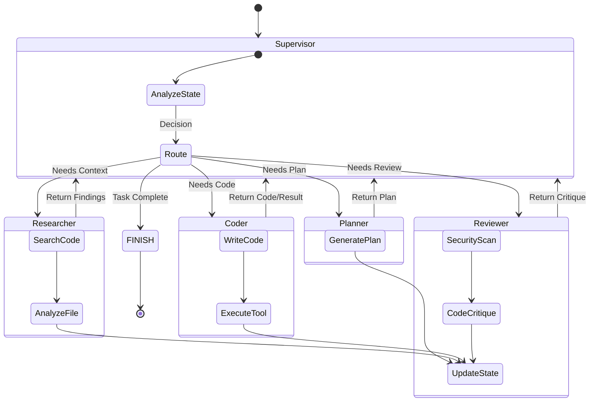
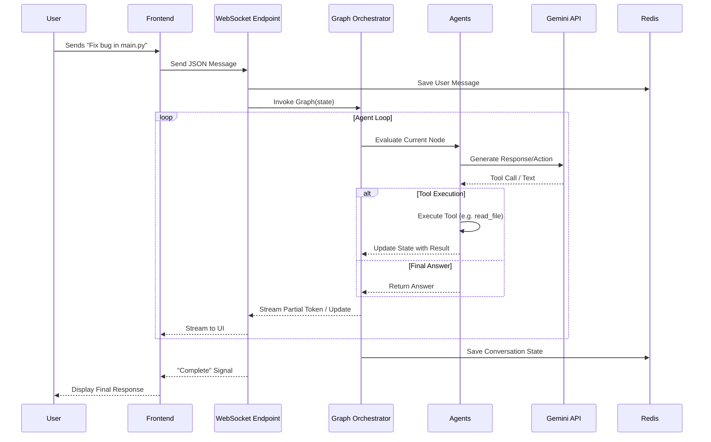
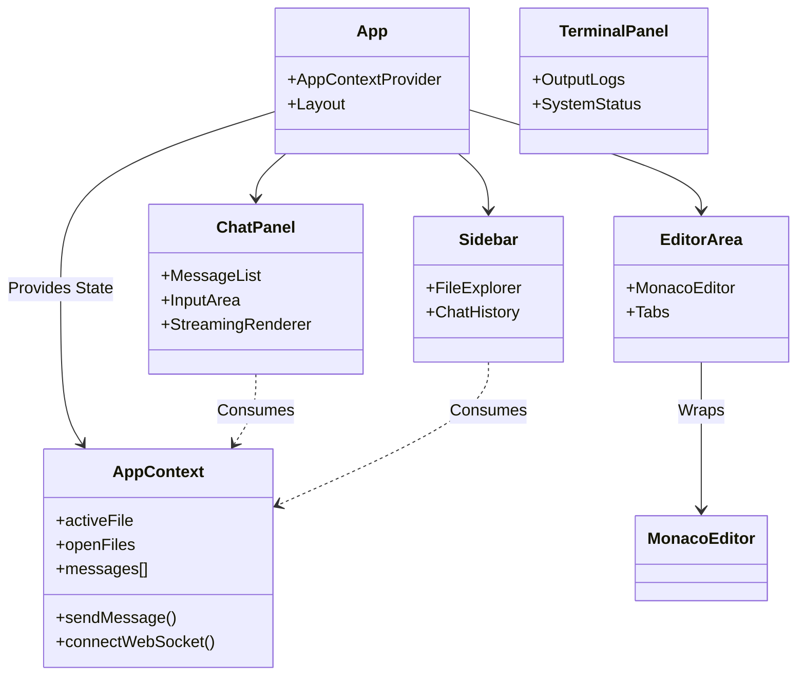
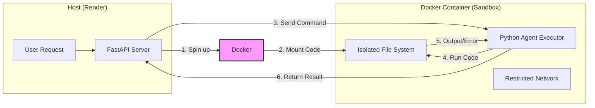

# AI Code Reviewer Backend

Production-ready backend for an AI code review system using LangGraph, Tree-Sitter, Docker sandbox, and Redis.

## Features

- **🤖 LangGraph Agent System**: Supervisor pattern with specialized worker nodes
- **🔍 Code Indexing**: Tree-Sitter based Python code parsing and analysis
- **🐳 Docker Sandbox**: Safe, isolated code execution with resource limits
- **💾 Redis State Management**: Persistent state storage with connection pooling
- **🔒 Security**: Path validation, file size limits, command timeouts
- **📊 Logging**: Structured JSON logging with multiple log levels
- **⚙️ Configuration**: Type-safe settings with environment variable validation
- **🔄 Retry Logic**: Automatic retries for LLM calls and Redis connections
- **🌐 WebSocket API**: Real-time code review interactions

## Architecture

### 1. High-Level Architecture Overview

This diagram shows how the User interacts with the Frontend (deployed on Vercel) and how requests flow to the Backend (deployed on Render), which orchestrates the AI Agents and services.


### 2. Multi-Agent Workflow (LangGraph)

The core intelligent engine of Construct is built on **LangGraph**. A **Supervisor Node** acts as the router, deciding which specialist agent should handle the next step based on the conversation state.



### 3. Request Processing Flow (WebSocket)

This sequence diagram illustrates the real-time communication flow when a user sends a message (e.g., "Fix this bug") via the WebSocket connection.



### 4. Frontend Component Structure

The React frontend handles the IDE-like interface, managing editor state, file trees, and the chat terminal.



### 5. Security & Sandbox Architecture

Code execution is isolated to prevent malicious or accidental damage to the backend server.



### Project Structure

```
backend/
├── main.py                 # FastAPI application with WebSocket
├── src/
│   ├── config.py          # Centralized configuration management
│   ├── logging_config.py  # Logging setup
│   ├── agent/             # LangGraph agent system
│   │   ├── graph.py       # Graph definition with state initialization
│   │   ├── nodes.py       # Supervisor, coder, and planner nodes
│   │   ├── prompts.py     # System prompts
│   │   └── state.py       # Agent state definition
│   ├── services/          # Infrastructure services
│   │   ├── indexer.py     # Tree-Sitter code indexing
│   │   ├── redis_store.py # Redis operations
│   │   └── sandbox.py     # Docker container execution
│   └── tools/             # Agent tools
│       ├── file_ops.py    # File read/write/list with validation
│       └── terminal.py    # Command execution with timeout
├── requirements.txt       # Python dependencies
├── Dockerfile            # Container configuration
└── .env.example          # Environment variables template
